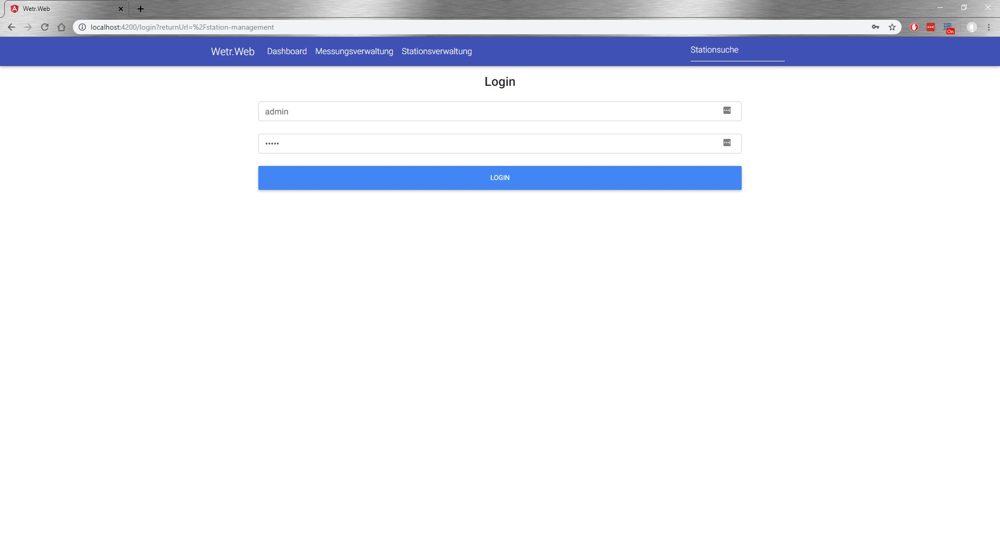

# 1 Installation

## 1.1 Voraussetzungen

• NPM

• Angular CLI

## 1.2 Verwendete Technologien

• Bootstrap

• Material Design for Bootstrap

• Font Awesome

## 1.3 Inbetriebnahme

Um das Projekt in Betrieb zu nehmen muss zunächst `npm install` durchgeführt werden um die
benötigten Packete zu installieren. Danach kann mit `ng serve` die Angular Anwendung gestartet
werden. Standardmäßig ist die Andwendung dann unter http://localhost:4200/ erreichbar.  
Die Adresse des zu verwendenden REST-Services kann in der Datei api-configuration.ts festge-
legt werden. Standardmäßig ist dort http://localhost:54405 hinterlegt.  

**Achtung**  
Um den Service ordnungsgemäß zu verwenden muss eine entsprechender REST-Service eingetragen
und verfügbar sein. ̈

# 2 Architektur

## 2.1 Komponentendiagram

## 2.2 Sequenzdiagramm
Dieses Sequenzdiagram zeigt den Aufbau der Architektur am Beispiel der Stationssuche.

# 3 Services

Die Services uns Modelklassen wurden automatisch aus dem vom REST-Service zur Verfugung ̈gestellten swagger.json generiert. Deswegen ist die Namensgebung und Codestruktur nicht optimal.

## 3.1 measuremen-service

• MeasurementGetMeasurementForStation(...)

Fuhrt eine einfache Abfrage der Messungen f ̈ ̈ur eine Station durch

• MeasurementGetAccumulationForStation(...)

Fuhrt eine akkumulierte Abfrage der Messungen f ̈ ̈ur eine Station durch

• MeasurementInsert(...)

Gibt eine neu erstelle Messungen an den REST-Service weiter.

## 3.2 user-service

• UserLogin(params: UserLoginParams)

Nimmt Benutzername und Passwort entgegen und gibt diese an den REST-Service weiter.

## 3.3 station-service

• StationGetAllStations(...)

Fragt alle Stationen ab.

• StationInsert(...)

Fugt eine neue Station ein ̈

• StationUpdate(...)

Andert eine bestehende Station ̈

• StationDelete(...)

Löscht eine bestehende Station

• StationGetById(...)

Fragt Station nach Stations•Id ab

• StationGetByCommunity(...)

Fragt Stationen nach Gemeinde ab

• StationGetByUsername(...)

Fragt Stationen nach Ersteller ab

• StationGetCommunities(...)

Fragt alle Gemeinden ab

# 4 Komponenten

## 4.1 Home

Diese Komponente stellt den Einstiegspunkt in die Anwendung dar. Von hier aus sind alle wichtigen Bereiche der Anwendung erreichbar. Außerdem wird nach man nach dem Ausloggen wieder auf diesen Bereich weitergeleitet.  

## 4.2 Header

Die Header-Komponenten ist immer sichtbar und beinhaltet die Navigation sowie die ̈offentliche Stationssuche.

## 4.3 Search

Die Search-Komponente ist in die Header-Komponente integriert und kann von jedem Benutzer verwendet werden um nach Stationen zu suchen und die Detailseiten der Stationen aufzurufen.

## 4.4 Dashboard

Die Dashboard-Komponente ist nur f ̈ur eingeloggte Benutzer verf ̈ugbar und zeigt die aktuelle Temperatur sowie Links zu den vorher favorisierten Stationen des Benutzers an.

## 4.5 Measurement-Management

Diese Komponente dient dazu um neue Messungen anzulegen. Sollten die Angaben nicht korrekt sein weißen Hinweismeldung darauf hin und der Button kann nicht gedr ̈uckt werden. Nach erfolg- reichem Absenden gibt eine weitere Hinweismeldung dem Benutzer Feedback ̈uber den Status der Operation.

## 4.6 Station-Management

Diese Komponente dient dazu um bestehende Stationen zu ̈andern oder zu löschen. Außerdem kann man von hier aus zur Seite SStation anlegen”navigieren.

## 4.7 Create-Station

Diese Komponente dient dazu um neue Stationen anzulegen.

## 4.8 Station-Details

Zeigt alle Daten zu einer Station an sowie Messungsdaten zu dieser Station. Hier gibt es außerdem die Möglichkeit fur eingeloggte Benutzer eine Station zum Dashboard ̈hinzuzufügen

## 4.9 Login

Auf diese Komponente wird der Benutzer verwiesen wenn er Bereiche der Anwendung aufruft auf die nur eingeloggte Benutzer Zugriff haben.

      
---

# WetrWeb

This project was generated with [Angular CLI](https://github.com/angular/angular-cli) version 7.2.0.

## Development server

Run `ng serve` for a dev server. Navigate to `http://localhost:4200/`. The app will automatically reload if you change any of the source files.

## Code scaffolding

Run `ng generate component component-name` to generate a new component. You can also use `ng generate directive|pipe|service|class|guard|interface|enum|module`.

## Build

Run `ng build` to build the project. The build artifacts will be stored in the `dist/` directory. Use the `--prod` flag for a production build.

## Running unit tests

Run `ng test` to execute the unit tests via [Karma](https://karma-runner.github.io).

## Running end-to-end tests

Run `ng e2e` to execute the end-to-end tests via [Protractor](http://www.protractortest.org/).

## Further help

To get more help on the Angular CLI use `ng help` or go check out the [Angular CLI README](https://github.com/angular/angular-cli/blob/master/README.md).
